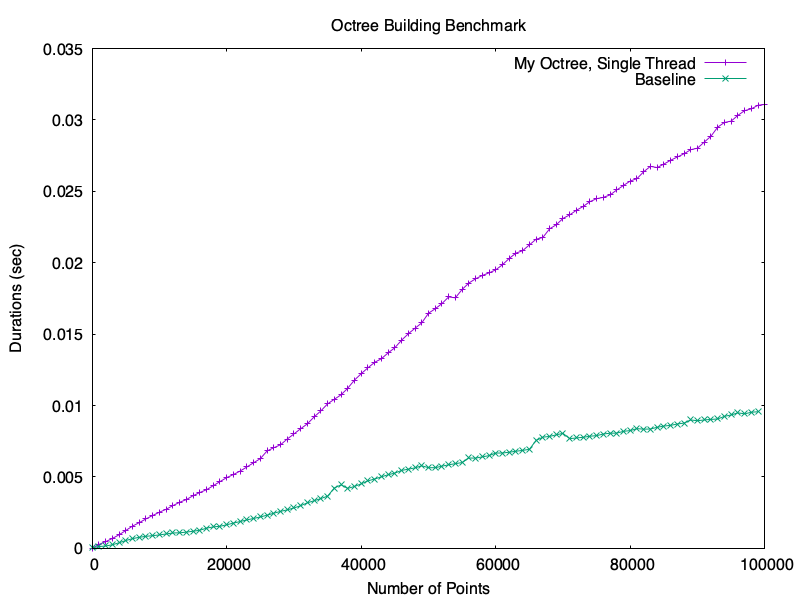

# Octree
Rust library for Octree, optimized for multi-threading, capable of tracking highly dynamic environment.

<div align="center">


[](https://wenqingzong.github.io/Octree/octree/index.html)


</div>

## Benchmark
An existing Rust Octree [library](https://github.com/ybyygu/rust-octree/tree/master) is used as the baseline performance in benchmark. Currently only building time is tested in benchmark. Query performance will be added later.



### How To Reproduce Benchmark Result
```shell
cd <path/to/repo/root>
python3 bin/generate_points.py
cargo run --bin=bench --release
```

## Todo
This library is under development, currently it's only a single threaded Octree implementation, but already supports dynamic object tracking.

Things to do in the near future:
 - Extend to multi-thread, can use [adriankrupa](https://github.com/adriankrupa/Octree)'s `C++` implementation as a reference.
 - A demo. Could use this library to reimplement my [N Body Simulator](https://github.com/WenqingZong/N-Body-Simulator). My current simulator was a coursework for `Computer Graphics` course at The University of Manchester, it used `python` with an $O(n^2)$ algorithm to calculate acceleration, its `FPS` is horrible.
 - Publish to [crates.io](https://crates.io) when the multithread feature is ready.